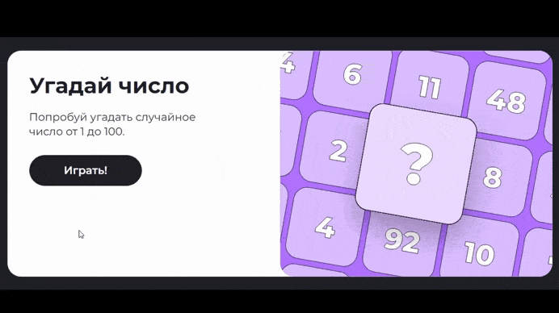

# Сайт мини-игр

Добро пожаловать на мой проект сайта мини-игр!</br>

Это одностраничный сайт, в котором собраны несколько увлекательных мини-игр. Основной акцент сделан на динамическом взаимодействии с пользователем через JavaScript, обеспечивая плавный игровой процесс и приятный интерфейс.

## Основные возможности:
- <b>Интерактивность на JavaScript</b><br>
Вся логика игр реализована с помощью современного JavaScript (ES6+), включая управление состояниями, таймерами и обработку событий. Игры реагируют на клики, нажатия клавиш и другие действия мгновенно.

- <b>Разнообразие игр</b><br>
В проекте несколько различных мини-игр с уникальными правилами и механиками, которые можно запускать и переключать без перезагрузки страницы. Каждая игра имеет понятный геймплей и цели.

- <b>Одностраничный дизайн</b><br>
Все игры доступны на одной странице сайта. Навигация происходит посредством кнопок или меню, что упрощает взаимодействие и ускоряет загрузку.

- <b>Адаптивность и кроссбраузерность</b><br>
Использование CSS3 и медиазапросов обеспечивает корректное отображение на разных устройствах — от больших мониторов до смартфонов. Проект протестирован в основных браузерах.

- <b>Минималистичный UI/UX</b><br>
Чистый дизайн с удобным расположением элементов, понятные кнопки и четкая типографика способствуют комфортной игре без лишних отвлекающих факторов.

- <b>Обработка ошибок и валидация</b><br>
Скрипты реализуют защиту от некорректных действий пользователя, например, предотвращают запуск игры без подготовки или двойные нажатия на кнопки.

- <b>Использование анимаций и визуальных эффектов</b><br>
Благодаря CSS-анимациям и скриптам интерфейс становится живым и привлекательным, создавая положительный пользовательский опыт.

<div align="center">
  
</div>


## Технологии и инструменты:
- <b>HTML5</b> — семантическая структура страницы
- <b>CSS3</b> — стилизация, адаптивная верстка и анимации, сделанные с использованием методологии БЭМ (Блок, Элемент, Модификатор) для удобства масштабирования и поддержки кода
- <b>JavaScript</b> — игровая логика, обработка событий, модульность кода

## Запуск проекта

1. Клонируй репозиторий на локальную машину:
```
git clone https://github.com/ashwagandhum/Mini-games-Website.git
```
2. Перейди в папку с проектом:
```
cd Mini-games-Website
```
3. Открой файл index.html в любом современном браузере (Chrome, Firefox, Edge и т.д.). Просто дважды кликни по файлу или выбери "Открыть с помощью браузера".

> Проект не требует установки дополнительных серверов или сборок, так как полностью реализован на HTML, CSS и JavaScript и работает напрямую в браузере.

## Возможности для расширения:
- Добавить новые мини-игры с разной механикой и тематикой
- Реализовать сохранение рекордов и прогресса в LocalStorage
- Добавить звуковые эффекты и фоновую музыку для создания атмосферы
- Внедрить анимации переходов между играми для более плавного UX
- Оптимизировать производительность для слабых устройств

## Деплой:
Сайт доступен онлайн по ссылке:
[https://ashwagandhum.github.io/Mini-games-Website/](https://ashwagandhum.github.io/Mini-games-Website/)

## Контакты

По вопросам и предложениям можно связаться через [мой Телеграм.](https://t.me/aarrggeennttuumm)

---

Спасибо, что посетили проект!
